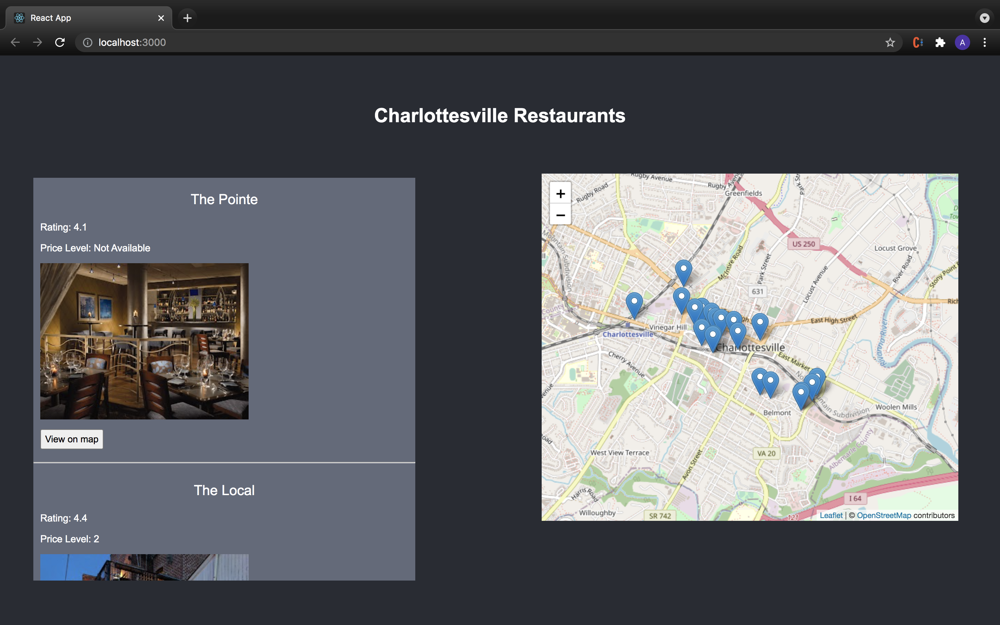

# Charlottesville Restaurants App

This project was bootstrapped with [Create React App](https://github.com/facebook/create-react-app).

## Description

This project shows a map of Charlottesville along with many of its restaurants. Scroll through a list of restaurants which includes pictures, ratings, and price levels. Check out the map to find the exact locations. 

## Used Packages 

* [axios](https://axios-http.com/docs/intro)
* [react-bootstrap](https://react-bootstrap.github.io/)
* [react-leaflet](https://react-leaflet.js.org/)

In addition to the packages listed above, I used the [Google Places API](https://developers.google.com/maps/documentation/places/web-service/overview) to gather information on the restaurants in Charlottesville. 

